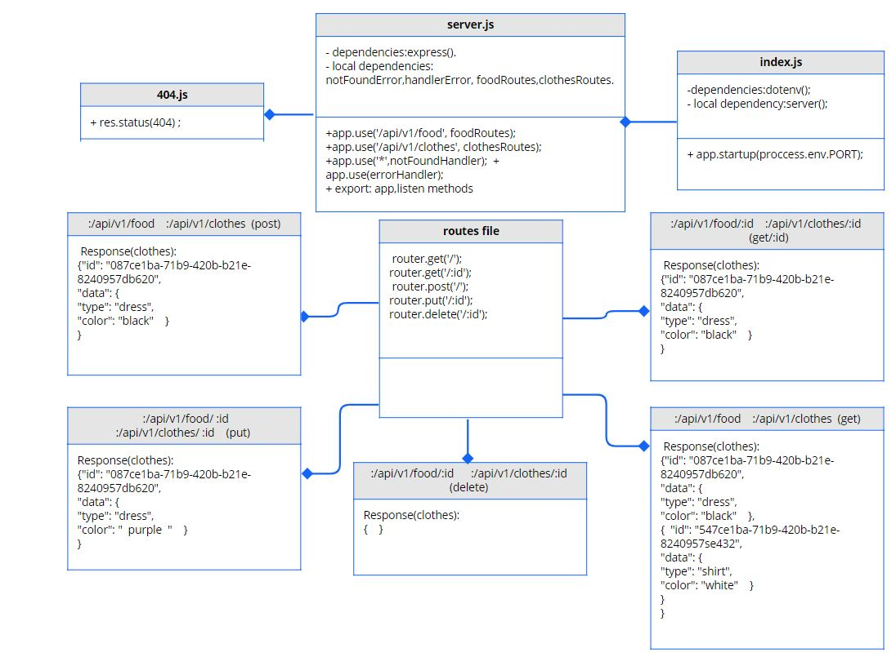

# Basic-api-server

## Author: Tamara Alrashed

### [Submission PR](https://github.com/Tamaraalrashed/basic-api-server/pull/2)

### [Tests Report](https://github.com/Tamaraalrashed/basic-api-server/actions)
### [Deployement](https://tamara--basic-api-server.herokuapp.com/)

## Setup

`.env`  requirements 
`PORT` - Port Number  

## Running the app  

`npm start`  

## Tests

Unit Tests: `npm run test`

## UML DIAGRAM
